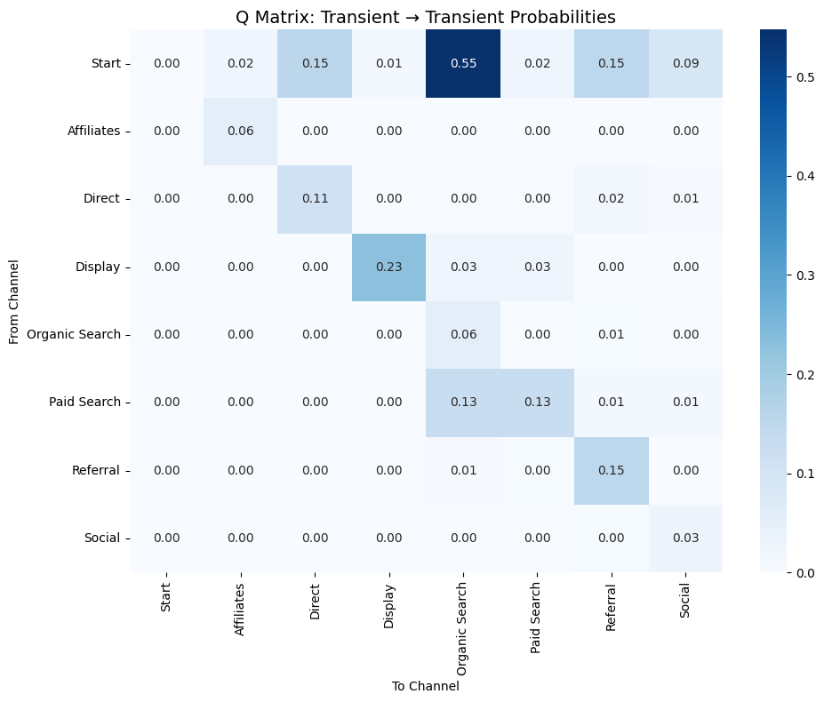
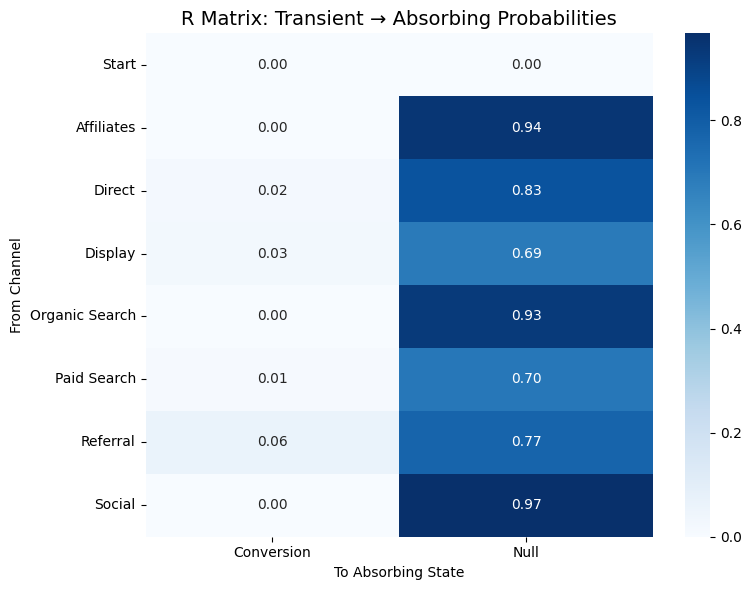
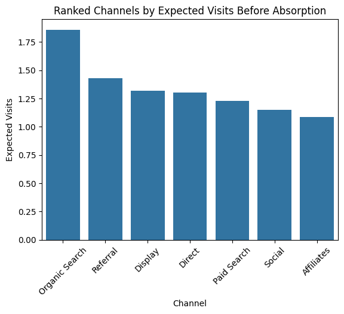
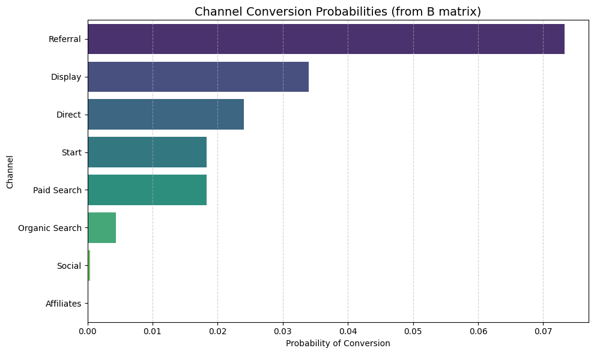
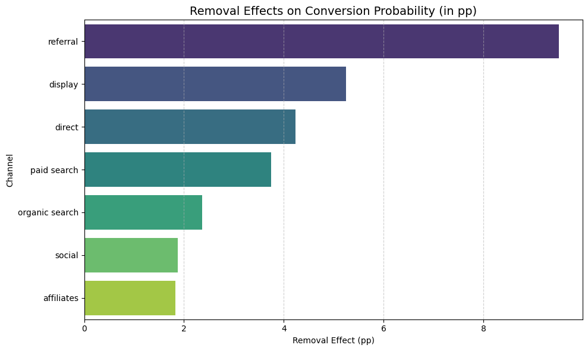

# Business Insight – Markov Chain Report

## Executive Summary
- Referral is the strongest driver of conversions; focus more budget and effort here.
- Organic Search drives traffic but converts poorly; landing pages and targeting need improvement.
- Direct and Paid Search show steady performance; worth optimizing further.
- Display, Social, and Affiliates work better for awareness than conversion.

---

## Transition Matrix Insights

### User Starting Points
- Most users start with **Organic Search (54.73%)**
- Other common entry points: **Direct (15.48%)**, **Referral (15.39%)**, **Social (8.72%)**
- Very few users begin with Affiliate, Display, or Paid Search

### Channel Conversion Rates
- Referral → Conversion: **6.19%** (highest)
- Direct → Conversion: **2.00%**
- Display → Conversion: **2.56%**
- Organic Search → Conversion: **0.37%**
- Paid Search → Conversion: **1.43%**

### Drop-off Rates
- Affiliates → Null: **94.23%**
- Direct → Null: **83.50%**
- Display → Null: **69.23%**
- Organic Search → Null: **92.79%**
- Social → Null: **96.71%**

### Repeated Channel Loops
- Display → Display: **23.08%**
- Direct → Direct: **11.25%**
- Affiliates → Affiliates: **5.77%**

### Key Insights
1. More than half of users start with Organic Search, but 92.79% drop off. Possible reasons: poor landing pages, slow site speed, or weak content.
2. Referral traffic converts best, with the highest conversion rate.
3. Social and Affiliates perform poorly, with high drop-offs and low conversions.
4. Display and Direct show potential but have low starting traffic.

---

## Q Matrix Insights
  
*Figure 1: Q Matrix – Transient to Transient Probabilities*

- Paid Search → Organic Search (13%): Many users move from paid ads to organic search, likely to research further. Better alignment between ads and organic content could help.
- Referral → Organic Search (1%): Some referred users continue exploring via organic search.
- High self-looping in Display, Direct, and Affiliates may suggest users are stuck or hesitant to take the next step.

---

## R Matrix Insights
  
*Figure 2: R Matrix – Transient to Absorbing Probabilities*

## Recommendations
- Referral drives the most conversions. Find out why it works well and allocate more budget to it.
- Organic Search brings traffic but does not convert — landing pages likely need fixing.
- Social and Affiliates may support awareness but need optimization.
- Direct traffic shows brand awareness but includes untraceable sources; deeper analysis with tools like Mixpanel is needed.

---

## N Matrix and Channel Ranking
  
*Figure 3: Ranked Channels by Expected Visits*

### Channel Roles in the User Journey
Each value shows the average number of visits before conversion or drop-off.

- Organic Search: A major touchpoint — users return often, but conversion is low.
- Referral: Strong engagement and high conversion — high-value channel.
- Display: Users spend more time here, likely due to retargeting or visuals.
- Direct: Reflects brand familiarity, but conversion paths need improvement.
- Paid Search: Frequent revisits, showing ad recall or research behavior.
- Social: Good for awareness, weak for conversions.

---

## B Matrix Insights
  
*Figure 4: Channel Conversion Probabilities (B Matrix)*

- Referral strongly drives users toward conversion.
- Organic Search and Social bring traffic but don’t lead to conversions.
- Display and Paid Search show conversion potential but need optimization.

---

## Channel Removal Effects
  
*Figure 5a: Removal Effects – Demo Chart*

- Referral is essential for conversions; invest in partnerships, influencers, and referral incentives.
- Display and Direct may not convert directly but keep users moving — retargeting helps.
- Paid Search brings in high-intent traffic.
- Organic Search is an important conversation starter in multi-touch journeys.
- Social and Affiliates are low impact but should not be removed entirely.

---

## Monte Carlo Simulation Insights
  
*Figure 5b: Removal Effects – Simulated Chart*

- Referral is the dominating channel. Invest more in partnerships, influencers, or referral incentives.
- Direct and Paid Search are solid performers — worth maintaining and optimizing.
- Organic Search needs rethinking. Although it drives the most traffic, it may not align with conversion goals (low-intent visitors, poor landing pages).
- Display, Affiliates, and Social may work better for awareness. They add value with tighter targeting and clearer CTAs.
